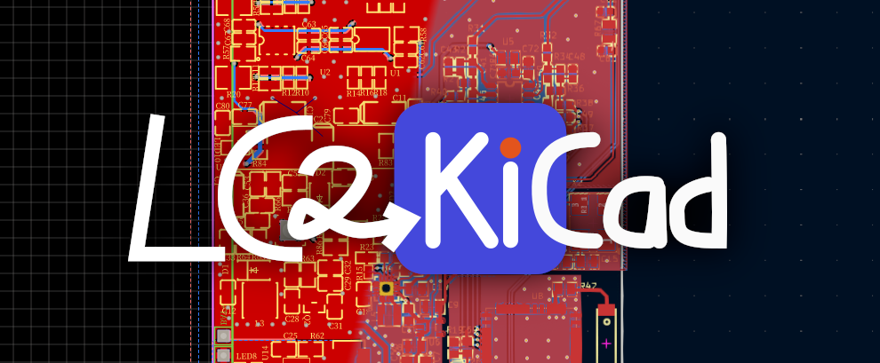

# LC2KiCad



[中文版本README](./docs/README.zh_CN.md)

## Deprecation Notice

### KiCad Version 8 has integrated EasyEDA (and Pro version) project import feature. This project has finished playing its role in project conversion and will be decommissioned from now on. Feb 8 2024

---

## Overview

LC2KiCad is a software that is designed to be able to convert documents of EasyEDA (or aka. LCEDA, since it's owned by LCSC) to documents of KiCad 5.0 or higher. It is completely free, main part of code is licensed under GNU LGPL v3 license.

**LC2KiCad is no longer in active development, and its feature is incomplete.*** Only schematic symbols, PCB footprints and PCBs are supported.

A newly created browser plugin can be used to extract footprints, symbols and 3D models may be interesting to you. Link: [lckiconverter](https://github.com/xtoolbox/lckiconverter)

LC2KiCad was initially started as a project that practices my C++ knowledge learned from *C++ Primer Plus*, so I managed to use as many features of the language as possible. Don't blame me for the messy overall architecture!

---

## How to compile the program

### Dependency

LC2KiCad requires C++ standard libraries to be present. Compilation process requires GCC and CMake. Other compilers were not tested. You will also need Git to be able to pull the repository (if required).

"8" of `-j 8` in the command, is the count of parallel jobs used during compilation. You could change the number according to your CPU core count.
### Linux

```shell
git clone https://github.com/rigoligorlc/lc2kicad.git
cd lc2kicad
mkdir build && cd build
cmake .. && make -j 8
```

The compiled executable is right in `lc2kicad/build/`.

### Windows

You need to get Git, CMake and Mingw working, and make sure all of them are available in PATH. The commands are virtually the same as Linux.

```
git clone https://github.com/rigoligorlc/lc2kicad.git
cd lc2kicad
mkdir build && cd build
cmake -G "MinGW Makefiles" .. && mingw32-make -j 8 
```

MSVC and Ninja are also supported. You may import the project into Visual Studio via CMakeLists.txt, or use cmake CLI directly.
### macOS

No macOS compilation has been done. But things should be similar to Linux environment. Install gcc, cmake with brew and try similar procedures.

---

## How to use LC2KiCad

### Important Notes!

- **LC2KiCad is available only in CLI (command-line interface) by design, and the author has no plan of adding a GUI.**

- **LC2KiCad is still working in progress, dleverything listed here are subject to change. Program might not work as how this part described. NO WARRANTY IS GUARANTEED.**

  
### Usable commands
- `lc2kicad`  Without an argument, the help message will be displayed.

- `lc2kicad -h` or `lc2kicad --help` Display the help message.

- `lc2kicad --version` Display the version and about message.

- `lc2kicad FILE1 [FILE2] ...` Convert the files specified.

  The following part describes other parameters that the program accepts.

- `-a PARSER_ARGS` Specify parser arguments. This is used for compatibility fixes, feature switches and other configurations for serializer and deserializer. See current documentation: [Parser Arguments Descriptions](docs/parser_arguments.md)
- `-v` Use verbose output. More information will be output.
- `--pipe` or `-p` Read file from STDIN until an EOF flag, output will come out of STDOUT.

### Not implemented functions
- `-o PATH` Specify output path.
- `-f CONFIG_FILE` Specify a configuration file rather than using the standard ones. Configuration file contains default output path, default parser arguments and other things.

### Functions planned
- `-P ... FILE1 FILE2 [FILE3] ...` Convert all specified files as a project, output a standard KiCad project. Multiple schematics are supported, but only the last PCB in the file list will be treated as the PCB associated with the project.
- `-S ... FILE1 FILE2 [FILE3] ...` Treat all the files as a separate part of a multi-part schematic symbol, output a multi-part symbol.


If LC2KiCad cannot open a new file to write into, it will write everything into the standard output stream.

**To be filled with other information**

---

## Licensing

LC2KiCad core part is licensed under GNU Lesser General Public License v3.

LC2KiCad utilized RapidJSON libraries which is licensed under MIT License.

Part of the program is ported from code licensed under Apache 2.0 License.

---

### Important Notes!

We **FORBID** the illegal use of converting others' files and libraries with the binary distribution of this program.

We **FORBID** the use that is outside the EasyEDA Terms of Use with the binary distribution of this program.

---

© Copyright RigoLigoRLC 2020.
